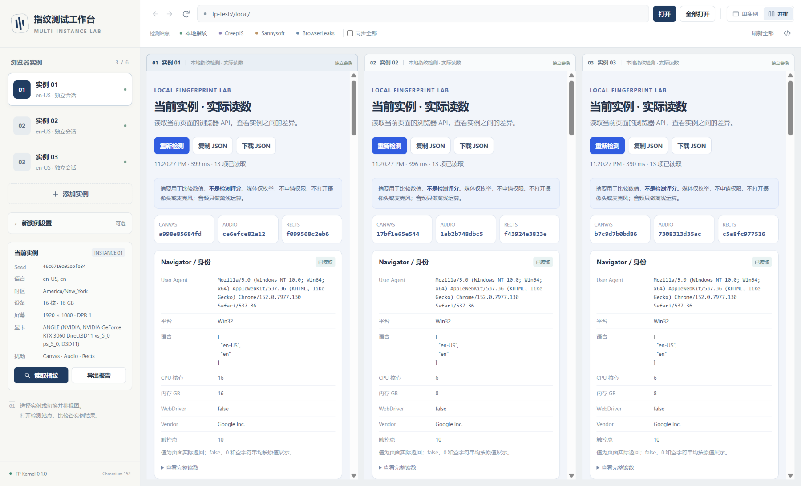

# FP Lab 项目使用手册

适用版本：工作台 `0.3.0`、SDK `0.1.0`，已验收内核 Electron `44.4.5` / Chromium `152.0.7977.130` / FP Kernel `0.1.0`。

新增功能入口：工作台顶部 **脚本与扩展**。导入/编辑 JS、自动执行、实例扩展启停和日志的完整操作见 [脚本与扩展使用指南](脚本与扩展使用指南.md)；二次开发见 [SDK 接入指南](../fp-sdk/README.md)。

本文按当前代码和 2026-09-27 UTC 保存的验收证据编写。命令使用 Windows PowerShell，历史示例路径以本机 `D:\project\webtt` 和 `D:\e\src` 为准；当前迁移、版本锁定、重建和发布请使用 [构建迁移与发布](构建迁移与发布.md) 中的可迁移入口。本文整理期间未重新运行第三方检测，引用的分数均属于此前保存的结果。

## 目录

1. [五分钟开始使用](#1-五分钟开始使用)
2. [项目组成与运行条件](#2-项目组成与运行条件)
3. [启动方式](#3-启动方式)
4. [界面操作](#4-界面操作)
5. [创建实例与配置指纹](#5-创建实例与配置指纹)
6. [读取指纹和导出报告](#6-读取指纹和导出报告)
7. [一套可复核的手动验证流程](#7-一套可复核的手动验证流程)
8. [检测平台与通过标准](#8-检测平台与通过标准)
9. [数据位置备份与独立测试环境](#9-数据位置备份与独立测试环境)
10. [运行自动验收](#10-运行自动验收)
11. [代码结构与开发维护](#11-代码结构与开发维护)
12. [常见问题](#12-常见问题)
13. [已知限制与当前验收结论](#13-已知限制与当前验收结论)
14. [相关资料](#14-相关资料)

## 1. 五分钟开始使用

1. 在资源管理器打开 `D:\project\webtt`，双击 **启动指纹测试.cmd**。
2. 首次启动会出现 `实例 01`、`实例 02`、`实例 03`，默认并排显示本地检测页。使用过的实例会恢复其配置和最后访问网址。
3. 等待本地页完成采集，查看上方 Canvas、Audio、Rects 三个摘要和下方实际参数。
4. 勾选顶部 **同步全部**，点击 **Sannysoft** 或 **CreepJS**，让所有实例打开同一检测站。
5. 点击左侧某个实例，再点击顶部 **单实例**，展开查看该实例完整的站点结果。
6. 点击左侧 **读取指纹** 查看实测快照；点击 **导出报告** 保存当前实例的配置与实际读数。
7. 出现 **在文件夹中查看报告 ↗** 后点击它，找到导出的 JSON。

检测站自己的分数、`lies` 和告警需要另行记录；工作台的“导出报告”保存浏览器 API 读数，不会自动把第三方网站的评分转成验收结论。



上图是保存的验收截图；每次创建实例的 seed 与设备配置可能不同，实际界面数值以当前运行结果为准。

## 2. 项目组成与运行条件

### 2.1 项目各部分分别做什么

| 部分 | 本机位置 | 用途 |
| --- | --- | --- |
| 工作台 | `D:\project\webtt\fp-demo` | 中文桌面界面、实例管理、内嵌网页、本地检测和报告导出 |
| 主进程 SDK | `D:\project\webtt\fp-sdk` | 实例创建、指纹生成、脚本管理、扩展生命周期；可用于自己的应用 |
| 内核补丁项目 | `D:\project\webtt\fp-kernel` | 指纹补丁、源文件镜像、规格、验收脚本和检测证据 |
| 完整源码及构建产物 | `D:\e\src`，Electron 源码在其 `electron` 子目录 | Chromium/Electron 编译与定制内核运行环境 |

`fp-kernel` 不是完整 Chromium 源码分发包，`fp-demo` 也没有把整个 Electron 运行时打包进去。迁移工作台源码时需一起复制同级 `fp-sdk`；还需准备兼容的完整定制内核运行目录。

每个实例使用独立持久化 Session，分区名称为 `persist:acc-<实例 ID>`。同一桌面窗口里的网页是实际浏览器视图，Cookie、localStorage 和 IndexedDB 按实例隔离。多个实例默认使用本机网络出口；独立浏览器存储不代表拥有不同公网 IP。

### 2.2 不同操作的依赖

| 你要做什么 | 需要什么 |
| --- | --- |
| 双击运行现有工作台 | Windows、PowerShell、现有定制 Electron 及其配套运行文件 |
| 使用本地检测页 | 不依赖外网；程序会启动仅监听 `127.0.0.1` 的本地服务 |
| 打开第三方检测站 | 可访问对应网站的网络 |
| `npm start`、工作台/三账号测试、公开站点采集 | Node.js；`npm` 只用于命令入口，工作台目前无第三方 npm 依赖 |
| 内核验收 | Python 3、已编译的定制 Electron |
| 补丁重放检查 | Python 3、Git、对应完整源码树和基线提交 |
| 从源码编译 | 已配置的 Electron/Chromium 编译环境；见第 11 节 |

普通 npm 版 Electron 没有本项目扩展的 `session.setFingerprintConfig`，不能替代定制内核。首次使用现有工作台无需执行 `npm install`。

## 3. 启动方式

### 3.1 双击启动

以下两个入口效果相同：

- `D:\project\webtt\启动指纹测试.cmd`
- `D:\project\webtt\fp-demo\启动指纹测试.cmd`

启动器依次读取 `FP_DEMO_ELECTRON`、项目 `runtime/current.json`、本机 `.fp-local.json`，最后尝试 `runtime/electron.exe`，并清理子进程中的 `ELECTRON_RUN_AS_NODE`。源码不再固定到原开发机路径。

同一用户数据目录采用单窗口实例锁。再次双击会显示并聚焦已有窗口，不会为每次启动再创建三个新实例。

### 3.2 使用 Node.js / npm

```powershell
Set-Location 'D:\project\webtt\fp-demo'
npm start
```

等价入口：

```powershell
node 'D:\project\webtt\fp-demo\scripts\start.js'
```

若 PowerShell 提示不能加载 `npm.ps1`，可直接使用 `npm.cmd start` 或上面的 `node` 入口，不必修改系统执行策略。

### 3.3 指定其他定制内核

下面只影响当前 PowerShell 会话启动的进程：

```powershell
$env:FP_DEMO_ELECTRON = 'D:\e\src\out\Testing\electron.exe'
& 'D:\project\webtt\启动指纹测试.cmd'
```

把第一行替换为其他定制 `electron.exe` 的完整路径即可。仅在终端临时设置变量，不会自动改变之后从资源管理器双击时的环境。

内核升级后不要仅凭旧账号文件中的 UA 判断新内核版本：已有账号配置会保留，代码没有通用的跨 Chromium 版本迁移机制。应备份原数据，在新的测试数据目录中生成配置并重新验收。

### 3.4 直接运行 Electron

```powershell
Remove-Item Env:ELECTRON_RUN_AS_NODE -ErrorAction SilentlyContinue
& 'D:\e\src\out\Testing\electron.exe' 'D:\project\webtt\fp-demo'
```

参数应指向 `fp-demo` 应用目录。应用入口由 `package.json` 指定为 `src/app.js`；`src/main.js` 是可被测试导入的模块，不是日常直接启动入口。

## 4. 界面操作

### 4.1 左侧实例区

| 控件 | 行为 |
| --- | --- |
| 实例名称 | 选中当前实例；切换本身不会刷新网页 |
| 添加实例 | 根据“新实例设置”创建并保存实例；最多六个 |
| 新实例设置 | 折叠表单；设置创建时的名称、语言、时区和噪声开关 |
| 当前实例 | 展示保存的 seed、语言、时区、CPU/内存、屏幕、显卡和扰动配置 |
| 读取指纹 | 从当前实例正在显示的页面采集实际 API 值 |
| 页面实测快照 | 展示上一次采集的实例名称、时间和主要数值 |
| 导出报告 | 重新采集当前实例，保存包含配置和读数的 JSON |
| 在文件夹中查看报告 | 定位本次运行中最近一次通过工作台导出的文件 |

“当前实例”显示的是保存的配置；“页面实测快照”显示的是采集结果。两者需要对照，不能用配置面板代替网页实际读数。切换实例后，旧快照仍可能留在侧栏，应核对快照中的实例名称和时间，或重新读取。

### 4.2 顶部浏览器工具栏

| 控件 | 作用范围 |
| --- | --- |
| 后退 / 前进 / 刷新 / 停止 | 当前选中的实例 |
| 地址栏 + 打开，或按 Enter | 当前实例 |
| 全部打开 | 所有已创建实例，包括单实例视图中暂时隐藏的实例 |
| 本地指纹 / CreepJS / Sannysoft / BrowserLeaks | 默认只打开当前实例；勾选“同步全部”后才同步所有实例 |
| 同步全部 | **只影响上述检测站快捷按钮**；不会把地址栏“打开”变成全部打开，也不联动滚动、点击或输入 |
| 刷新全部 | 所有实例 |
| 单实例 / 并排 | 改变视图布局；不会新建或删除实例 |
| 开发者工具图标 | 打开当前实例的 DevTools，用于排查页面问题 |

地址栏支持 HTTP、HTTPS。省略协议时默认补 `https://`；本地 HTTP 站点应明确输入 `http://`。不接受带用户名密码的网址，代理认证也不通过地址栏填写。

`fp-test://local/` 是工作台内部的本地页入口别名，实际页面运行在 `http://127.0.0.1:<临时端口>/`。不要把它当作 Windows 已注册的通用浏览器协议。

### 4.3 单实例与并排

默认三个实例分为三列；四到六个实例分为两行，最多三列。单实例模式适合查看检测站的宽表格，并排模式适合对照摘要与关键参数。

点击任一页面或其标题可切换当前实例。隐藏的实例仍保留其网页和 Session；单实例模式不等于暂停其他实例。关闭主窗口才会关闭本次运行的全部浏览器视图。

网页要求新窗口打开的普通 HTTP/HTTPS 链接会被工作台转到原实例中打开，不提供独立标签页管理。

## 5. 创建实例与配置指纹

### 5.1 创建步骤

1. 展开左侧 **新实例设置**。
2. 填写名称，选择语言，填写有效的 IANA 时区。
3. 设置 Canvas、Audio、Rects 扰动开关。
4. 点击 **添加实例**。新实例会打开本地检测页并成为当前实例。
5. 查看“当前实例”配置，再点击“读取指纹”核对实际返回值。

不展开设置直接添加时，使用表单现有值；初始语言为 `en-US`，时区为 `America/New_York`，三个扰动开关均开启。创建后只清空名称输入，语言、时区和开关会保留在表单中，继续添加时请先核对。

### 5.2 可设置的项目

| 项目 | 支持范围 | 说明 |
| --- | --- | --- |
| 名称 | 自定义文字，保存时最多 48 个字符 | 便于区分实例 |
| 语言 | 界面提供 `en-US`、`zh-CN`、`en-GB`、`ja-JP`、`de-DE` | 生成语言列表，并配置页面语言和请求语言 |
| 时区 | 例如 `America/New_York`、`Asia/Shanghai`、`Asia/Tokyo`、`Europe/London`、`UTC` | 无效时区会拒绝创建 |
| Canvas | 开 / 关 | 控制相关像素读回扰动 |
| Audio | 开 / 关 | 控制相关音频采样扰动 |
| Rects | 开 / 关 | 控制几何/文字测量相关扰动，具体范围以补丁规格为准 |

语言和时区不会自动根据公网 IP 推断。若要验证区域一致性，需主动核对所选配置与当前测试网络环境。

### 5.3 自动生成的项目

每次创建会产生独立随机 seed，再从设备模板中确定 CPU 核数、内存、屏幕和 GPU 参数。当前模板文件为：

- `D:\project\webtt\fp-demo\src\profiles\win10-intel.json`
- `D:\project\webtt\fp-demo\src\profiles\win11-nvidia.json`

新实例 UA 的完整 Chromium 版本来自当前实际内核；字体默认使用 `win-default` 模板。界面不提供单独编辑 UA、GPU、CPU、屏幕、字体名单或 seed 的控件。

保存配置后，刷新网页、切换实例和重新启动程序都不会主动重新生成 seed。不同实例仍可能选到相同 CPU、显卡或屏幕组合，这是模板取值重合；不要要求所有字段都不同。

### 5.4 当前不提供的实例操作

界面尚未提供删除实例、重命名已有实例、编辑已有配置、克隆实例或重置 seed。达到六个实例后不能继续从界面添加；可按第 9 节使用新的数据目录开始另一组测试。

“新实例设置”只影响随后创建的实例，不会修改当前选中实例。分别创建一个开噪声、一个关噪声的实例，还会同时生成不同 seed 和设备配置，因此不是严格的单变量对照实验。

## 6. 读取指纹和导出报告

### 6.1 三种读数入口

| 入口 | 读什么 | 是否自动重新采集 |
| --- | --- | --- |
| 本地检测页 | 此页面的浏览器 API 读数 | 打开时自动采集；“重新检测”再次采集 |
| 侧栏“读取指纹” | 当前实例正在访问的页面中的 API 读数 | 每次点击重新采集 |
| 第三方检测站 | 站点自己的检测脚本与评分 | 由该站点决定，结果不等于工作台本地读数 |

采集期间不要跳转页面。侧栏采集整体超时为 10 秒；探针的各异步项目通常有约 2.4 秒的独立超时。超时、API 不可用和数值错误分开记录，不会统一填成“通过”。

### 6.2 本地页主要字段

| 区域 | 主要内容 |
| --- | --- |
| Navigator / 身份 | UA、平台、语言列表、核数、内存、webdriver 等 |
| UA Client Hints | brands、平台、移动标志、高熵版本和架构信息 |
| 时区 / 国际化 | Intl locale、timeZone、UTC 偏移及固定时间格式化结果 |
| 屏幕 / 视口 | 配置屏幕、可用区域、页面视口、DPR、颜色深度 |
| WebGL / GPU | vendor、renderer、版本、纹理能力等 |
| Canvas / Audio / Rects | 测量值摘要和详细数值 |
| 字体 / TextMetrics | 指定字体请求下的文字度量；不是完整的已安装字体清单 |
| 插件 / PDF | 插件列表、MIME 类型、PDF 查看器标志 |
| 语音列表 | 语音名称、语言、URI 等；不实际合成或播放 |
| 媒体设备枚举 | 未请求权限时可读取的设备信息；不打开摄像头或麦克风 |
| 测量上下文 | 实际 URL、origin、可见性、采集时间、探针版本等 |

摘要卡只显示完整哈希的前 12 个字符；严谨对比时展开完整读数或使用 JSON。摘要对象中的 `algorithm` 指出所用算法；不同算法、探针版本或绘制/测量方案的哈希不可直接比较。

屏幕尺寸和页面视口不是同一字段。切换单实例/并排会改变网页视口，但不应据此判定保存的屏幕配置失效。远端页面的字体、根元素缩放或变换也可能影响几何读数，应在相同页面与缩放条件下比较。

### 6.3 状态含义

| JSON 状态 | 页面文字 | 含义 |
| --- | --- | --- |
| `ok` | 已读取 | API 值已成功取得；不代表指纹检测通过 |
| `partial` | 部分读数 | 某些字段失败，其他值仍保留 |
| `unsupported` | API 不可用 | 当前上下文没有该 API 或无法创建必要对象 |
| `error` | 读取错误 | 采集时抛出异常，详细原因在 `error` / `errors` |
| `timeout` | 读取超时 | 在该项目等待期限内未取得结果 |

### 6.4 三种 JSON 的区别

| 操作 | 保存内容 | 位置 |
| --- | --- | --- |
| 侧栏“导出报告” | 实例 ID/名称、内核版本、保存配置、刚采集的实测值 | 固定写入 `D:\project\webtt\fp-demo\exports` |
| 侧栏“复制完整 JSON” | 最近一次实测快照，包含实例 ID、配置、URL、时间及读数 | 剪贴板；不重新采集 |
| 本地页“复制 JSON” / “下载 JSON” | 本地页最近一次探针结果 | 剪贴板或浏览器下载流程指定的位置；不是固定的 `exports` 目录 |

工作台导出文件名为 `fingerprint-<实例 ID 前 8 位>-<时间戳>.json`。每次导出都会重新读取当前实例，不会默认导出全部实例；需要逐个选中并导出。

工作台报告的主要字段如下：

| 字段 | 用途 |
| --- | --- |
| `formatVersion` | 报告格式版本 |
| `createdAt` | 此次采集的 UTC 时间 |
| `account.id` / `account.name` | 实例标识，名称可能重复，优先用 ID 对照 |
| `versions` | Electron、Chromium 和 FP Kernel 版本 |
| `configuration` | 保存的指纹配置，含 seed |
| `observed` | 探针实际结果，含各项目的 `status` / `data` |
| `observed.context.data.url` | 采集时正在访问的页面 |
| `note` | 报告范围说明 |

例如 UA 可对照 `configuration.uaString` 和 `observed.navigator.data.userAgent`，语言可对照 `configuration.navigator.languages` 和 `observed.navigator.data.languages`，时区可对照 `configuration.timezone` 和 `observed.intl.data.dateTime.timeZone`。

时间戳、采集耗时、页面 URL、视口、可见性及动态网页标题可能变化，不应把整个 JSON 每个字段都相同作为稳定性的要求。JSON 还会按标准把数值 `-0` 写成 `0`，这不表示精度数据被篡改。

## 7. 一套可复核的手动验证流程

### 7.1 记录环境

先复制一份 [测试记录模板](测试记录模板.md)，填写日期、内核版本、实例 ID、seed、网址、窗口布局、缩放和网络环境。

记录“是否完成采集”“是否通过本地断言”“检测站是否报告异常”三个不同结论。打不开网站或采集不完整时，记录为未完成，不记作通过。

### 7.2 验证单实例稳定性

1. 选中实例 01，打开本地指纹页，固定窗口和布局。
2. 等待采集完成，导出基准报告。
3. 点击“重新检测”至少三次，比较相同测量方案下的 Canvas / Audio / Rects 完整摘要。
4. 刷新页面，再导出一份报告，核对 seed、UA、语言、时区和相关摘要。
5. 正常关闭程序后重开，在相同条件下再次采集。

对于本项目“固定 seed”设计，固定配置项与相同方案下的确定性摘要应保持稳定。若发现变化，先检查内核/探针版本、窗口尺寸、页面内容、权限和 origin，再定位代码。

### 7.3 验证多个实例的预期差异

让三个实例在同一网址、相同布局下完成测量，分别导出报告。核对实例 ID 和 seed 不同；开启扰动的项目在当前既有测试场景中应产生相应差异。

CPU、内存、屏幕或 GPU 可能恰好相同。网络出口也可能相同。关注保存配置与实际返回是否一致，不以“所有字段都不同”作为目标。

### 7.4 验证 Cookie / 存储隔离

优先运行第 10 节的三账号验收，它已覆盖 Cookie、localStorage、IndexedDB 以及重启后的保留。

需要手动检查时，让各实例打开同一个本地检测页，在当前实例的开发者工具 Console 中写入测试值：

```javascript
localStorage.setItem('fp-lab-manual-check', 'instance-01');
document.cookie = 'fp_lab_manual_check=instance-01; path=/; SameSite=Lax';
```

切换到实例 02，打开它的开发者工具读取：

```javascript
localStorage.getItem('fp-lab-manual-check');
document.cookie;
```

干净测试状态下，不应读到实例 01 刚写入的值。再分别写入不同的实例标记，切换回来核对。测试结束可只清理自己创建的两个键：

```javascript
localStorage.removeItem('fp-lab-manual-check');
document.cookie = 'fp_lab_manual_check=; Max-Age=0; path=/';
```

本地检测页的端口在重启后可能变化，localStorage 按 origin 隔离，不能直接用不同端口的两次本地页读取证明“重启丢失”。跨进程存储验证应使用固定 origin，或使用自动验收脚本。

### 7.5 检查第三方检测站

1. 在三个实例中打开同一检测站，等待结果完整出现。
2. 记录每个实例的失败项、`lies` 明细和站点版本/检测时间，不只截总分。
3. 保存站点截图，并导出工作台 API 快照。
4. 有异常时，在同系统、同版本普通 Chrome 中运行同一检查作为基准；没有匹配版本则注明未完成该对照。
5. 重复测试确认是否可复现，分清站点问题、网络问题、权限/布局差异和内核问题。

在 [Fingerprint Demo](https://fingerprint.com/demo/) 中可以额外记录 Visitor ID 及访问历史，观察跨实例是否被该服务关联。这是该服务的识别结果，不能单独证明所有网站都能或都不能关联这些实例。

## 8. 检测平台与通过标准

### 8.1 平台入口

以下是官方入口；前三个已有工作台快捷按钮，其余可粘贴到地址栏。平台功能说明基于本次会话查阅的官方页面，具体界面可能随站点更新。

| 平台 | 侧重点 | 推荐用途 |
| --- | --- | --- |
| [CreepJS](https://abrahamjuliot.github.io/creepjs/) | API 异常、几何/音频/字体/Canvas 等一致性 | 展开 `lies`，定位具体 API；使用该 GitHub Pages 官方地址 |
| [Sannysoft](https://bot.sannysoft.com/) | WebDriver、Chrome 对象、插件、权限等 | 快速检查基础自动化特征 |
| [BrowserLeaks](https://browserleaks.com/) | 浏览器参数、Canvas、字体、WebRTC、DNS、TLS 等 | 按项目核对原始值及网络泄漏 |
| [BrowserScan](https://www.browserscan.net/) | 指纹参数、内核/UA、时区、IP、Bot 等 | 综合参数一致性 |
| [Pixelscan](https://pixelscan.net/) | 指纹、代理/IP、DNS、WebRTC、Bot 等 | 将浏览器异常与网络异常分开查看 |
| [IPhey](https://iphey.com/) | 浏览器、位置、IP、软硬件特征 | 补充交叉验证 |
| [Fingerprint Demo](https://fingerprint.com/demo/) | Visitor ID、访问记录、识别信号 | 观察固定实例与跨实例的识别结果 |
| [AmIUnique](https://amiunique.org/) | 指纹样本分布与特征 | 查看其样本中指纹的独特程度 |
| [EFF Cover Your Tracks](https://coveryourtracks.eff.org/) | 跟踪防护、可识别特征 | 隐私与抗跟踪评估 |

### 8.2 怎样记录“通过”

建议采用下面的项目验收口径；这是本项目的复核方法，不是所有网站共同认可的统一标准。

| 层级 | 可以证明什么 | 不能据此推出什么 |
| --- | --- | --- |
| 本地 API 读数成功 | 页面能读取对应字段 | 返回值一定合理、没有修改痕迹 |
| 工作台/内核断言通过 | 已编写的功能、稳定性、隔离断言通过 | 所有网站均不会识别该环境 |
| Sannysoft 无失败项 | 它当前检查的这些项目通过 | CreepJS 或商业识别服务也通过 |
| CreepJS 无未解释的异常 | 该次检查未发现需要解释的 API 矛盾 | 永远不可识别；低 headless 分数也不能抵消 `lies` |
| 网络检查符合预期 | 当前出口、DNS/WebRTC 路径符合测试要求 | 浏览器指纹本身已通过全部检测 |

对 `lies` 的理想目标是 0；有值时应记录原文并与正常浏览器基准对照。站点总分、某个哈希“唯一”、不同实例哈希不同，都不应直接记作“全部通过”。

## 9. 数据位置备份与独立测试环境

### 9.1 文件位置

| 数据 | 默认位置 | 是否属于完整备份的一部分 |
| --- | --- | --- |
| 实例配置与 seed | `%APPDATA%\fp-demo\accounts.json` | 是 |
| Cookie/存储等浏览器数据 | `%APPDATA%\fp-demo\Partitions\acc-<实例 ID>`，及 userData 中其他相关文件 | 是，优先备份整个 userData |
| 脚本、扩展登记、扩展副本、执行日志 | `%APPDATA%\fp-demo\automation` | 是；扩展登记的绝对路径恢复要求见新增指南 |
| 工作台导出报告 | `D:\project\webtt\fp-demo\exports` | 按需单独备份；不属于上述 userData |
| 工作台自动测试证据 | `D:\project\webtt\fp-demo\test-results` | 按需保存 |
| 内核测试证据 | `D:\project\webtt\fp-kernel\test-results` | 按需保存 |
| 公开站点证据 | `D:\project\webtt\fp-kernel\reports\phase5` | 按需保存 |

本机默认 userData 对应 `C:\Users\51129\AppData\Roaming\fp-demo`。使用自定义 `--user-data-dir` 后，配置和分区存储位于指定目录；工作台导出的 `exports` 路径仍在项目目录。

仅复制 `accounts.json` 能保留 ID 和指纹配置，但不能保留完整的网站登录/存储状态。仅复制项目源码目录同样不会带走默认 userData。

### 9.2 备份

先正常关闭工作台，避免运行中的浏览器数据库继续变化。以下示例只复制，不删除或覆盖原目录：

```powershell
$labSource = Join-Path $env:APPDATA 'fp-demo'
$labBackup = Join-Path 'D:\project\webtt\backups' ('fp-demo-' + (Get-Date -Format 'yyyyMMdd-HHmmss'))
if (-not (Test-Path -LiteralPath $labSource -PathType Container)) {
    throw '找不到默认工作台数据目录，请确认是否使用了自定义 userData。'
}
if (Test-Path -LiteralPath $labBackup) {
    throw '备份目标已存在，请更换目标路径。'
}
New-Item -ItemType Directory -Path (Split-Path -Parent $labBackup) -Force | Out-Null
Copy-Item -LiteralPath $labSource -Destination $labBackup -Recurse
Write-Output $labBackup
```

备份中可能含 Cookie、浏览历史或手工配置的代理认证信息。保管这些文件时按实际数据内容处理；恢复到另一台 Windows 机器或用户时，浏览器加密凭据不保证可用。

### 9.3 开始全新的测试组

先关闭现有工作台，再指定一个未使用过的数据目录；不需要删除当前数据：

```powershell
Remove-Item Env:ELECTRON_RUN_AS_NODE -ErrorAction SilentlyContinue
& 'D:\e\src\out\Testing\electron.exe' 'D:\project\webtt\fp-demo' '--user-data-dir=D:\project\webtt\profiles\fresh-test-01'
```

新目录初次启动会创建三个新实例。再次使用同一个路径会继续这组实例；换另一个新路径才会创建另一组。不要让两个进程同时使用同一个数据目录。

`--user-data-dir` 是当前定制 Electron 支持的原生启动参数。Node 启动器也会透传额外参数，例如在 `fp-demo` 目录执行 `npm.cmd start -- --user-data-dir=D:\project\webtt\profiles\fresh-test-01`；双击用的 `.cmd` / `.ps1` 入口本身不透传自定义参数。

双击默认启动器不会记住这条命令里的自定义目录，之后仍打开默认 `%APPDATA%\fp-demo`。若要继续这组测试，请复用同一条命令。

### 9.4 复核备份与配置文件

需要测试备份是否可恢复时，先把备份复制到一个新的复核目录，再以该目录作为 `--user-data-dir` 启动，避免首次复核就覆盖现有数据。

`accounts.json` 最外层必须是数组。主要字段是 `id`、`name`、`url`、`proxy`、可选的 `proxyAuth` 和完整 `fp` 对象。读取失败时程序会报错并保留原文件，不会静默重置为三个新实例。

不要在程序运行中编辑该文件：导航会保存最后 URL，可能覆盖外部编辑。不要随意删除实例 ID 或 `fp`；ID 决定存储分区，缺失 `fp` 时程序会生成新指纹。高级字段没有完整的可视化校验与迁移功能，日常测试优先使用界面支持的选项。

## 10. 运行自动验收

以下是复现命令，不会在阅读文档时自动执行。它们使用测试专属数据目录；某些测试为了截图会短暂显示测试窗口。不要把测试专属配置文件复制到日常使用的数据目录。

### 10.1 工作台端到端验收

```powershell
Set-Location 'D:\project\webtt\fp-demo'
npm.cmd run test:tester
```

覆盖界面操作、并排布局、切换不刷新、独立存储、当前/全部导航、新实例语言时区、真实指纹、报告导出与 IPC 来源校验。对应脚本也可直接运行：

```powershell
node 'D:\project\webtt\fp-demo\tests\run-tester.js'
```

输出位于 `fp-demo\test-results\tester-<UTC 时间>\`，主要包含 `summary.json`、`tester.json`、stdout/stderr 日志、导出样本和界面截图。以 `summary.json` 的 `passed` 及具体失败项判断本地验收结果。

### 10.2 三账号与跨进程重启验收

```powershell
Set-Location 'D:\project\webtt\fp-demo'
npm.cmd run test:acceptance
```

脚本依次启动两个独立 Electron 进程，复用测试专属 userData 和同一个本地站点，验证 Cookie、localStorage、IndexedDB、指纹稳定性及重启保留。输出位于 `fp-demo\test-results\<UTC 时间>\`。

这两类工作台测试的内核路径使用 `FP_DEMO_ELECTRON`，与工作台启动器一致。

### 10.3 内核验收

```powershell
Set-Location 'D:\project\webtt\fp-kernel'
python scripts/run-acceptance.py
```

单独复核某组，或指定其他构建：

```powershell
python scripts/run-acceptance.py tests/phase3/accept_rects.js --electron 'D:\e\src\out\Testing\electron.exe' --timeout 90
```

每个脚本有独立临时 profile。输出位于 `fp-kernel\test-results\<本机时间戳>\`，汇总字段为 `ok`，逐脚本记录通过数、失败数、退出码、超时状态和日志路径。

字体测试依赖宿主已安装的字体；原报告的排除对照字体是 Cascadia Code。换机器后的失败需要结合测试前置条件分析。完整测试范围见 [本地验收报告](../fp-kernel/reports/ACCEPTANCE.md)。

### 10.4 公开检测站证据采集

这个入口访问外部网站，默认直连，使用固定虚构配置和独立临时 userData；它不会读取工作台当前三个实例的数据。

```powershell
$env:FP_ELECTRON = 'D:\e\src\out\Testing\electron.exe'
Remove-Item Env:ELECTRON_RUN_AS_NODE -ErrorAction SilentlyContinue
$env:FP_PHASE5_LABEL = 'manual-review'
$env:FP_PHASE5_ACCOUNTS = '3'
node 'D:\project\webtt\fp-kernel\tests\phase5\run.js'
```

| 环境变量 | 用途 |
| --- | --- |
| `FP_ELECTRON` | 此采集器的内核路径，注意不是 `FP_DEMO_ELECTRON` |
| `FP_PHASE5_LABEL` | 给本次运行加标签 |
| `FP_PHASE5_ACCOUNTS` | 账号数量，默认 1，最多 3；三个账号需显式设置为 3 |
| `FP_PHASE5_OUTPUT` | 自定义证据输出目录 |
| `FP_PHASE5_SETTLE_MS` | 导航完成后的等待毫秒数，默认 45000 |
| `FP_PHASE5_REVISION` | 可选的构建提交说明，仅作为报告元数据记录 |

默认输出为 `fp-kernel\reports\phase5\<UTC 时间>\`，包含 manifest、页面原文、API 读数、配置及截图。

三个账号、两个站点的采集会耗费数分钟，采集器有全局超时保护。不要把内核本地脚本的 90 秒默认超时套用为整个公开站点采集的预期完成时间。

`COLLECTED` 和进程退出码 0 仅表示采集流程完成；必须继续阅读站点的实际判断。主站无法导航、子资源失败、站点结构改版导致无法解析，要分别记录。

需要生成汇总时，将 `<实际运行目录>` 替换为刚输出的完整目录：

```powershell
node 'D:\project\webtt\fp-kernel\tests\phase5\summarize.js' '<实际运行目录>'
```

**汇总脚本会更新 `fp-kernel\reports\phase5\REPORT.md`，同时在运行目录写入 `summary.json`。** 需要保留旧版主报告时先备份，原始各次证据目录仍应保留。

采集器使用隐藏窗口、1440×1100 设定视口及全拒绝权限策略，和可见工作台的窗口/权限条件并非完全一致。其结果应单列环境，不能当作当前工作台实例已经重新测试的证明。详细规则见 [阶段 5 采集说明](../fp-kernel/tests/phase5/README.md)。

## 11. 代码结构与开发维护

本节面向需要修改工作台或内核的开发者。日常手动验证只需前十节和常见问题。

### 11.1 工作台代码入口

| 文件 | 职责 |
| --- | --- |
| `D:\project\webtt\fp-demo\src\app.js` | 正式桌面应用入口 |
| `D:\project\webtt\fp-demo\src\main.js` | Session、内嵌视图、布局、导航、IPC、采集和导出 |
| `D:\project\webtt\fp-demo\src\accounts.js` | 账号配置读取、保存与已有 UA 格式修复 |
| `D:\project\webtt\fp-demo\src\fp-generator.js` | 转发 SDK 的指纹生成接口 |
| `D:\project\webtt\fp-sdk\profiles` | 当前生效的 Windows 设备模板；旧 `fp-demo/src/profiles` 已不被生成器读取 |
| `D:\project\webtt\fp-sdk\lib` | 实例创建、指纹生成、脚本与扩展管理实现 |
| `D:\project\webtt\fp-demo\src\management.js` / `src\manage` | 脚本扩展管理窗口、受信 IPC、编辑界面 |
| `D:\project\webtt\fp-demo\src\sidebar` | 工作台页面、样式与受信 preload |
| `D:\project\webtt\fp-demo\src\testing` | 本地检测页和可复用的指纹采集函数 |
| `D:\project\webtt\fp-demo\tests` | 工作台和三账号验收 |

外部网页没有工作台 preload，禁用 Node 集成并启用 sandbox 与 contextIsolation。账号按 Session 设置代理/直连、UA 和 `setFingerprintConfig`，然后才加载页面。指纹改动主要由定制内核实现，不是由检测页脚本伪造分数。

修改 HTML/CSS/JavaScript 或本地探针后，正常关闭并重新打开工作台即可载入文件；通常不需要编译 C++ 内核。修改模板只影响之后新生成的配置，已有实例不会自动套用新模板。

修改 `src/main.js` / preload / 实例存储时，运行工作台测试和三账号验收；修改内核相关代码时，运行对应内核脚本，并依据影响范围追加回归和公开站点复核。

### 11.2 内核维护入口

| 目录 / 文件 | 用途 |
| --- | --- |
| `D:\project\webtt\fp-kernel\VERSION` | 当前 Electron 补丁基线标记 `v44.4.5` |
| `D:\project\webtt\fp-kernel\patches\chromium` | Chromium 补丁集合 |
| `D:\project\webtt\fp-kernel\patches\electron` | Electron 补丁集合 |
| `D:\project\webtt\fp-kernel\src` | 项目自有源文件镜像 |
| `D:\project\webtt\fp-kernel\specs` | 历史规格与设计记录 |
| `D:\project\webtt\fp-kernel\FP_PATCHES.md` | 补丁用途、钩子、验收方式和已知事项 |
| `D:\e\src` / `D:\e\src\electron` | 实际编译源码树；不是上述镜像目录 |

规格文档中可能存在早期方案，例如设备数量和权限策略，与最终交付行为不同。日常使用说明优先以当前代码和验收报告为准；不要仅修改源文件镜像就认为实际构建已经改变。

### 11.3 固定工具链与独立重建

完整流程见 [构建迁移与发布](构建迁移与发布.md)。`fp-kernel/build/lock.json` 固定源码提交、补丁校验值、工具链和 GN 参数。当前实际使用 VS2026/MSVC 14.50.35717、Windows SDK 10.0.26100.0，旧 VS2022 描述不再适用。

在项目根目录设置自己的空构建目录和工具链目录后运行：

```powershell
python fp-kernel/scripts/release.py doctor --windows-toolchain $Toolchain
python fp-kernel/scripts/release.py prepare --workspace $BuildRoot --windows-toolchain $Toolchain
if ($LASTEXITCODE -ne 0) { throw '准备失败' }
python fp-kernel/scripts/release.py build --workspace $BuildRoot --windows-toolchain $Toolchain --jobs 12
```

输出位于 `$BuildRoot/src/out/FPTesting`。工具版本不符、补丁失败、源码 tree 不符或编译失败均停止；不会重置原开发目录。运行已发布包不需要上述编译环境。

### 11.4 校验补丁能否重放

```powershell
Set-Location 'D:\project\webtt\fp-kernel'
python scripts/verify-patches.py --output test-results/patch-replay.json
```

脚本在临时目录依序重放 Chromium 的 `fp_*.patch`，比较结果与当前源码，不切换真实源码树的分支、不改其索引。它会产生临时数据和所指定的结果报告。

| 参数 | 默认值 / 说明 |
| --- | --- |
| `--source` | 显式参数、`FP_SOURCE_ROOT` 或本机 `.fp-local.json` 的 `source` |
| `--patches` | 项目的 `patches\chromium` |
| `--base` | 锁定清单 `verification.chromiumFpBase` |
| `--output` | 报告路径；不要放进被校验的源码树 |

退出码 0 表示成功，1 表示重放或内容对比失败，2 表示输入/运行错误。升级源码版本时应重新确定基线，不能直接把旧提交当作新版本基线。

### 11.5 导出当前 P2 补丁

该操作会写文件，供修改内核后的开发维护使用：

```powershell
Set-Location 'D:\project\webtt\fp-kernel'
python scripts/export-p2.py
python scripts/verify-patches.py --output test-results/patch-replay.json
```

`export-p2.py` 只覆盖 fp_41 / fp_42 / fp_43 指定路径的补丁导出。默认源树读取 `FP_SOURCE_ROOT` 或本机配置，默认基线读取锁定清单 `verification.p2Base`，可用 `--source`、`--base` 覆盖。

它会写入本项目三个补丁、复制到 Electron 补丁目录、更新 `.patches` 清单并同步源文件镜像。它不负责编译、Git 提交或完成所有验收。源码升级后必须核对新的 P2 之前基线；执行前查看并保存相关仓库改动，执行后审查 diff 和重放结果。

### 11.6 构建、导出与升级入口

| 脚本 | 当前行为 |
| --- | --- |
| `fp-kernel/scripts/apply.ps1` | 在空目录重放固定源码及补丁，支持 `-Resume`，失败即停止 |
| `fp-kernel/scripts/check-env.ps1` | 核对锁定工具版本，不修改系统配置 |
| `fp-kernel/scripts/export.ps1` | 在新的评审目录输出汇总 diff，不覆盖已有有序补丁 |
| `fp-kernel/scripts/upgrade.ps1` | 目标版本须匹配候选锁；新目录准备/可选编译，失败不更新 VERSION |
| `fp-kernel/scripts/release.py` | 完整的准备、编译、运行时打包、校验、迁移验收、发布集合与切换回退入口 |

跨 Electron 版本仍需适配补丁并独立验收。`upgrade-plan` 生成候选计划，`capture-lock` 在评审后生成候选锁；正式锁和 `VERSION` 只在验收通过后更新。详见 [升级和失败恢复说明](构建迁移与发布.md)。

### 11.7 代理配置属于开发入口

账号结构中保留了 `proxy` 和可选 `proxyAuth`，主进程可按实例设置代理及响应代理认证，但当前界面没有对应控件，真实代理和认证尚未验收。

`proxy` 为空时使用显式 `mode: 'direct'`，不会自动继承系统代理规则。修改系统代理后发现工作台仍直连，应先核对这一行为。开发者如需试验已有代理字段，应关闭工作台、备份完整配置、按 Electron 代理规则格式编辑并重启复核；不要在页面地址栏嵌入代理用户名密码。

## 12. 常见问题

| 现象 | 检查与处理 |
| --- | --- |
| 提示找不到定制 Electron | 按迁移指南安装运行时，或在当前启动环境设置 `FP_DEMO_ELECTRON` |
| 提示“不支持指纹配置” | 当前启动的是普通 Electron 或不匹配的构建；使用含 `setFingerprintConfig` 的定制内核 |
| 只看到后台进程，没有工作台 | 确认启动的是应用目录，`package.json` 主入口为 `src/app.js`；不要把 `src/main.js` 当应用入口 |
| 再次启动没有增加实例 | 正常行为；同一数据目录的重复启动只聚焦现有窗口。新实例需点击“添加实例” |
| 添加按钮不可用 | 已达到六个实例，或创建过程尚未结束。当前界面没有删除实例功能 |
| 改了语言或噪声但当前实例没变 | “新实例设置”仅影响随后创建的实例 |
| 地址输入后全部实例没变化 | 地址栏“打开”只操作当前实例；点击“全部打开”。“同步全部”只控制检测站快捷按钮 |
| 并排页面太窄 | 选中目标实例并切换“单实例”；切换后视口变化，比较时保持同一布局 |
| 网站显示加载失败 | 先确认本地检测页能打开，再核对网址、外网、证书或代理配置；查看实例标题/状态提示 |
| 指纹采集超时或跳转报错 | 等页面稳定加载后重试；检查是否在采集期间跳转、崩溃或正在重定向 |
| 某项显示“不可用”或“部分读数” | 展开完整读数查看原因；安全上下文、权限、页面策略和 API 可用性都会影响采集 |
| 摄像头、麦克风、定位无法授权 | 当前工作台不提供授权流程，实例权限策略会拒绝这些请求；只能验证允许读取的枚举/离线信息 |
| 外部检测站的复制按钮失败 | 实例只为当前本地检测页开放剪贴板写权限。可用侧栏“复制完整 JSON”或“导出报告”保存工作台结果 |
| 三个实例公网 IP 相同 | 默认全部直连，同一网络出口属于预期行为；独立 Session 不会改变公网 IP |
| Screen 和页面宽高不一致 | Screen 是屏幕配置，页面视口由内嵌面板尺寸决定，二者不需要相等 |
| 重启后本地页媒体 ID / localStorage 有变化 | 先比较 origin；临时端口可能变化。使用固定 origin 做持久性对照 |
| 复制了项目却没有原来的实例 | 日常实例在 `%APPDATA%\fp-demo`，不在源码目录；需要单独备份 userData |
| 导出后找不到文件 | 侧栏导出在项目 `exports`；本地页下载走浏览器下载流程，这两个入口位置不同 |
| `accounts.json` 读取失败 | 关闭程序，备份现有文件，检查 JSON 和最外层数组结构，或从备份在新目录中复核恢复 |
| 用新内核后 UA 仍是旧版本 | 已有配置会保留；在新数据目录生成配置并验证升级，不要假定已自动迁移 |
| 语音/媒体列表有项目但不能实际使用 | 当前验收覆盖枚举模板，尚未证明模板 ID 对应真实设备或每个语音都可合成 |
| Sannysoft 全绿但 CreepJS 报错 | 两站检测项不同；记录 CreepJS 的具体 `lies`，不能用另一站的分数抵消 |
| 本地 `PASS` 很多是否代表所有网站通过 | 不能。自动测试断言、实际 API 读数、外部站点评分应分别记录 |

## 13. 已知限制与当前验收结论

以下为已保存证据的结论，不是本文编写期间新跑出的结果：

| 范围 | 已保存结果 | 证据 |
| --- | --- | --- |
| 工作台端到端 | 57/57 | [工作台验收](../fp-demo/TESTER-ACCEPTANCE.md) |
| 三账号隔离与重启 | 91/91 | [三账号说明](../fp-demo/ACCEPTANCE.md) |
| 内核本地断言 | 206/206 | [内核验收](../fp-kernel/reports/ACCEPTANCE.md) |
| Chromium 补丁重放 | 12 个补丁、41 个文件逐字节一致 | [补丁证据](../fp-kernel/reports/acceptance/patch-replay.json) |
| Sannysoft | 三个测试账号各 31 passed / 0 failed | [公开检测报告](../fp-kernel/reports/phase5/REPORT.md) |
| CreepJS | 每个账号 4 lies：几何两项、音频两项 | 同上，尚未全通过 |

CreepJS 原始异常包括 `Element.getClientRects` 的 `failed math calculation`、`unknown rotate dimensions`，以及 `AudioBuffer` 的 `audio is fake`、`sample noise detected`。

还需要明确以下范围：

- 当前是开发目录中的桌面工作台，没有验收完整的独立安装包或跨机器发行。
- 真实代理及认证、外部账号登录、实际 PDF 加载/打印、模板设备 ID 到物理设备的映射、实际 TTS 合成，均未完成相应验收。
- 仓库中的翻译 preload 是历史占位代码，当前账号页面没有加载它；不提供翻译服务。
- 字体白名单依赖宿主已安装字体，不附带字体文件。
- Accept-CH 的持久化目前为进程内存级，重启后的行为与完整 Chrome prefs 持久化不同。
- 本机此前检查到的普通 Chrome 是 154，已验收内核是 Chromium 152，同版本真实 Chrome 152 基准对照仍未完成。
- 配置、存储和部分测量具有隔离性，不代表网络出口不同，也不保证第三方无法关联实例。

## 14. 相关资料

- [项目首页](../README.md)
- [测试记录模板](测试记录模板.md)
- [工作台简明说明](../fp-demo/README.md)
- [工作台验收记录](../fp-demo/TESTER-ACCEPTANCE.md)
- [内核补丁登记表](../fp-kernel/FP_PATCHES.md)
- [内核阶段进度](../fp-kernel/STATUS.md)
- [P2 实现规格](../fp-kernel/specs/fp_31_40_41_42_43_p2.md)
- [公开站点采集脚本说明](../fp-kernel/tests/phase5/README.md)
- [公开站点检测报告](../fp-kernel/reports/phase5/REPORT.md)
